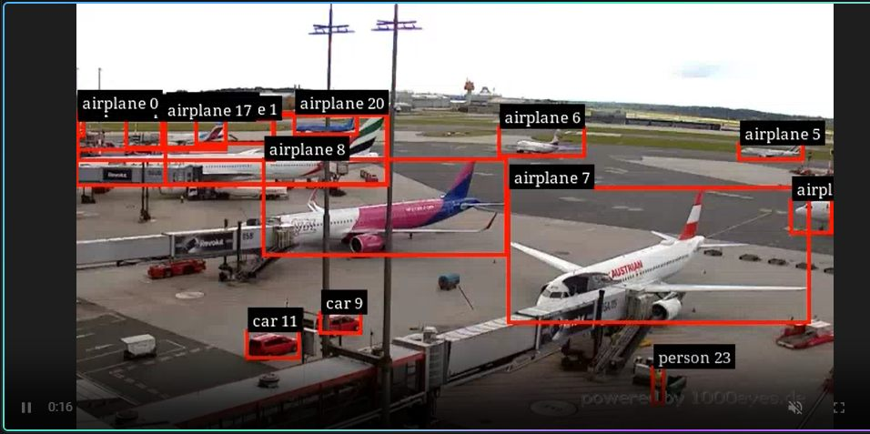

# INFERENCER

RF-DETR inference and object tracking for the Jetson Orin Nano Super.

| Capability | Implementation |
|------------|----------------|
| Object detection | [RF-DETR](https://github.com/roboflow/rf-detr) with TensorRT |
| Tracking | NVIDIA NvSORT with persistent tracking IDs |
| Telemetry | MQTT detection and tracking payloads |
| Supervision | MediaMTX WebRTC preview |
| Control | REST API for model preparation and pipeline lifecycle |

Based on [RidgeRun/deepstream-rfdetr](https://github.com/ridgerun/deepstream-rfdetr),
now using DeepStream 9.1 and JetPack 7.2 on the Orin Nano (sm_87).




## TL;DR

### Run manually on the server

```bash
./run_pipeline.sh --input hls --output webrtc
```

### use

[relevant API calls: load, start, stop](#load-start-stop)

### Outputs

MQTT listener:
```bash
conda activate py312
python -u mqtt-listener.py
```

WebRTC output: [http://192.168.1.71:8889/deepstream-rfdetr/](http://192.168.1.71:8889/deepstream-rfdetr/)


## Control API

The control API uses the `INFERENCER_API_KEY` environment variable.

Create the key on the server:
```bash
echo "INFERENCER_API_KEY=$(openssl rand -hex 32)" >> .env
```

Install and start the API as a systemd service on the server:
```bash
sudo ./install-service.sh
```

The service listens on port `8090` and binds to `0.0.0.0` for LAN access.
Restrict port `8090` with the server firewall to trusted clients. The service
reads `INFERENCER_API_KEY` from `.env`, starts automatically at boot, and
restarts after a failure.

Manage the service with:
```bash
sudo systemctl status inferencer
sudo systemctl restart inferencer
sudo systemctl stop inferencer
journalctl -u inferencer -f
```

On a LAN client, add the server address and API key to `~/.bashrc`:
```bash
echo 'export INFERENCER_SERVER=<SERVER-IP-HERE>' >> ~/.bashrc
echo 'export INFERENCER_API_KEY=<YOUR-KEY-HERE>' >> ~/.bashrc
source ~/.bashrc
```

`GET /status` is unauthenticated for health checks. Mutating endpoints require
the bearer token:

### load-start-stop

```bash
API="http://${INFERENCER_SERVER}:8090"
KEY="$INFERENCER_API_KEY"

# get status
curl -s "$API/status"

# load model
curl -s -X POST "$API/load-model" \
  -H "Authorization: Bearer $KEY" \
  -H 'Content-Type: application/json' \
  -d '{"model":"rfdetr-medium","precision":"fp16"}'

# start pipeline
curl -s -X POST "$API/start" \
  -H "Authorization: Bearer $KEY" \
  -H 'Content-Type: application/json' \
  -d '{"output":"webrtc"}'

# stop pipeline
curl -s -X POST "$API/stop" \
  -H "Authorization: Bearer $KEY"
```

`/load-model` prepares the ONNX and TensorRT engine; `/start` allocates the
runtime GPU resources and begins MQTT publishing. `/stop` releases them.


## Target Platform

| Component    | Version / Detail                          |
|--------------|-------------------------------------------|
| Board        | Jetson Orin Nano Super 8 GB (p3767-0005)  |
| GPU arch     | Ampere, sm_87                             |
| JetPack      | 7.2 GA (L4T R39.2.0)                     |
| OS           | Ubuntu 24.04 (Noble)                      |
| DeepStream   | 9.1                                       |
| TensorRT     | 10.16.2                                   |
| CUDA         | 13.2                                      |
| Compiler     | GCC 13.3.0, C++20                         |

> **Note:** The Orin Nano Super has no DLA cores and no hardware video
> encoder. Use `x264enc` (software) for file output pipelines.

## Quick Start

### 1. Installation

```bash
# install uv (once)
curl -LsSf https://astral.sh/uv/install.sh | sh
```

```bash
sudo apt update && sudo apt install -y deepstream-9.1
```

Install the native MQTT runtime and the GStreamer plugin families used by the
runner. DeepStream supplies its own NVIDIA plugins; these packages supply the
standard GStreamer elements used around them (`souphttpsrc`, `rtmpsink`,
`h264parse`, `x264enc`, `flvmux`, and `splitmuxsink`):

```bash
sudo apt install -y \
  ca-certificates curl libmosquitto1 mosquitto-clients \
  gstreamer1.0-tools \
  gstreamer1.0-plugins-base \
  gstreamer1.0-plugins-good \
  gstreamer1.0-plugins-bad \
  gstreamer1.0-plugins-ugly \
  gstreamer1.0-libav \
  libgstrtspserver-1.0-0
```

The pipeline connects to HiveMQ, so a local Mosquitto broker service is not
required. `libmosquitto1` is required by DeepStream's native MQTT adaptor;
`mosquitto-clients` is optional and provides command-line publish/subscribe
tools for diagnostics.

This pulls in TensorRT, cuDNN, and all required GStreamer plugins.
If you also need `nvcc` (e.g. building PyTorch from source):

```bash
sudo apt install -y cuda-toolkit-13-2
```

Create or select the Python environment used by the MQTT listener. The
project uses Conda for the listener and test scripts; `uv` is used separately
by `make setup` for the isolated model-download script:

```bash
conda create -n py312 python=3.12 -y  # omit if py312 already exists
conda activate py312
python -m pip install -r requirements.txt
```

```bash
# install MediaMTX
cd /tmp
curl -sL "https://github.com/bluenviron/mediamtx/releases/download/v1.19.3/mediamtx_v1.19.3_linux_arm64.tar.gz" \
  -o mediamtx.tar.gz
tar xzf mediamtx.tar.gz
sudo mv mediamtx /usr/local/bin/
```


### 2. Build the parser library

```bash
make
```

Produces `libdeepstream-rfdetr.so`.

### 3. Set Up The Model

```bash
# Download weights and configure the default model
make setup MODEL=rfdetr-small PRECISION=fp16
```

The runtime model is selected in `pipeline_config.yml`:

```yaml
model:
  size: "rfdetr-small"
  precision: "fp16"
  class_ids: [1, 3]
```

`model.class_ids` is the COCO class allowlist. For example, `[1, 3]` keeps
only `person` and `car`; use `[]` to keep all classes. The runner translates
the allowlist into DeepStream's `filter-out-class-ids` setting before starting
the pipeline.

When `run_pipeline.sh` starts, it runs `make setup` with these YAML values.
That downloads the ONNX if needed and updates the nvinfer config before
starting the pipeline. Available models are `rfdetr-nano`, `rfdetr-small`,
`rfdetr-medium`, and `rfdetr-large`; supported precisions are `fp16` and
`fp32`.

### 4. Run inference

```bash
gst-launch-1.0 -e \
  filesrc location=/opt/nvidia/deepstream/deepstream/samples/streams/sample_1080p_h264.mp4 \
  ! decodebin ! queue ! mux.sink_0 \
  nvstreammux name=mux width=1920 height=1080 batch-size=1 ! \
  nvinfer config-file-path=deepstream_rfdetr_bbox_config.txt ! \
  queue ! nvdsosd ! nvvideoconvert ! x264enc ! h264parse ! mp4mux ! \
  filesink location=output.mp4
```

Adjust `nvstreammux` width/height to match your input resolution.

DeepStream sources and samples: `/opt/nvidia/deepstream/deepstream-9.1`

### 5. YAML-Controlled Pipeline

Configure the input, streammux resolution, RTSP endpoint, output resolution,
and x264 encoder in
`pipeline_config.yml`. The default input is a public webcam HLS stream; audio
is discarded. `source.type` supports `hls` and `file`; `csi` is reserved
for a future camera input. For a file input, set `source.type: file` and
provide a `file://` URI in `source.file_uri`.

The default HLS input is the configured public webcam. The runner uses
DeepStream's `nvurisrcbin` with audio disabled, which is suited to this live
HLS source. When
`source.stream_offset_seconds` is omitted or set to `0`, the runner passes the
live HLS playlist directly to GStreamer. The offset-based manifest slicing is
only used for the legacy Tears of Steel source. The input defaults to
`source.type` in `pipeline_config.yml`; override it for one run with
`--input file` or `--input hls`:

```bash
./run_pipeline.sh --input file --output file
./run_pipeline.sh --input hls --output webrtc
./run_pipeline.sh --input hls --output rtsp
```

`file` writes timestamped MP4 segments. `rtsp` and `webrtc` start MediaMTX when
needed, publish local RTMP, and serve the stream at the configured endpoint,
such as `rtsp://192.168.1.71:8554/deepstream-rfdetr` for the default
configuration. The path
and port are controlled by `outputs.rtsp.mount_point` and `outputs.rtsp.port`.

RTSP output, for example in VLC:
`rtsp://192.168.1.71:8554/deepstream-rfdetr`

WebRTC using MediaMTX, for example in a browser:
`http://192.168.1.71:8889/deepstream-rfdetr`

The runner advertises `192.168.1.71` for WebRTC and enables TCP fallback for
the ICE connection. If the device is reached through another LAN address, set
the advertised address before starting the pipeline:

```bash
WEBRTC_ADDITIONAL_HOSTS=192.168.1.75 ./run_pipeline.sh --input hls --output webrtc
```


All timing values are seconds. Defaults are no stream offset, 60-second file
segments, and a two-minute capture. The corresponding YAML
values can be overridden for one run with environment variables:

Set `runtime.identity_sync: false` in `pipeline_config.yml` to process file
inputs as quickly as the pipeline allows. Keep it `true` when producing
real-time HLS, RTSP, or WebRTC playback so frames remain paced to their
timestamps.

```bash
STREAM_OFFSET_SECONDS=180 SEGMENT_DURATION_SECONDS=30 CAPTURE_DURATION_SECONDS=120 \
  ./run_pipeline.sh --output file
```

The source is paced in real time, so two minutes produces about four MP4 files.
On stop, the script sends `SIGINT`, then `SIGKILL` after 10 seconds if input is
blocked; only the active MP4 segment can be incomplete.

The runner suppresses routine GStreamer bus messages and starts a new
MediaMTX instance with warning-level logging to keep the console readable.
For troubleshooting, restore verbose output with:

```bash
GST_LAUNCH_QUIET=false MEDIAMTX_LOG_LEVEL=info \
  ./run_pipeline.sh --input hls --output webrtc
```

### Native DeepStream Tracking

The pipeline uses NVIDIA's native `nvtracker` plugin after RF-DETR inference.
Select the low-level tracker in `pipeline_config.yml`:

```yaml
tracking:
  algorithm: "NvSORT"
  detector_threshold: 0.3
  min_detector_confidence: 0.3
  min_iou_diff_new_target: 0.5780
  min_tracker_confidence: 0.8216
  probation_age: 5
  max_shadow_tracking_age: 26
  min_matching_iou: 0.2159
```

Available tracker configurations installed with DeepStream 9.1 are:

| Configuration | Behavior |
|---------------|----------|
| `NvSORT`      | Lightweight motion and IoU association; recommended default on the Orin Nano |
| `IOU`         | Simplest IoU-only association and lowest overhead |
| `NvDCF`       | Correlation-filter tracking with stronger short-term occlusion handling |
| `NvDeepSORT`  | Appearance-aware tracking using re-identification; highest resource use |

The tracker writes IDs directly into DeepStream object metadata. The custom
metadata bridge copies those IDs into the MQTT payload as `track_id`.

`detector_threshold` controls RF-DETR detections before they reach the tracker.
The remaining values are native tracker thresholds: the detector confidence
floor, IoU required when creating a new target, tracker confidence below which
an object becomes a shadow track, the probation period, the maximum shadow
tracking age, and the minimum IoU association score. Some values are not used
by simpler configurations such as `IOU`.

### 6. MQTT Detection Publishing

The YAML runner publishes one DeepStream detection event per detected object
to the HiveMQ broker configured under `mqtt.brokers`.

The runner automatically sources the project `.env` file before starting. Make
sure it contains the HiveMQ credentials:

```bash
# .env
HIVEMQ_MQTT_USER='your-hivemq-username'
HIVEMQ_MQTT_PASSWORD='your-hivemq-password'

./run_pipeline.sh --input hls --output webrtc
```

The default topic is `vision/detections`. The runner uses DeepStream's
`nvmsgconv` and `nvmsgbroker` plugins with the installed MQTT protocol adaptor
and HiveMQ TLS port `8883`. Credentials are written to a restrictive temporary
file for the lifetime of the process and removed during cleanup.

#### Detection Payload

The runner uses a custom compact payload converter. One MQTT message represents
one detected object on one frame. The payload structure is:

```json
{
  "timestamp": "2026-08-01T12:05:47.201023Z",
  "detections": [
    {
      "bbox": [56.0, 88.0, 91.0, 121.0],
      "class": "person",
      "confidence": 0.934521
    },
    {
      "bbox": [120.0, 64.0, 183.0, 151.0],
      "class": "car",
      "confidence": 0.882104
    }
  ]
}
```

The runner publishes one message per frame. `detections` contains all objects
detected in that frame. Each `bbox` contains pixel coordinates in
`[x1, y1, x2, y2]` order. Class names are read from `coco91_labels.txt`, and
`confidence` is the RF-DETR detection confidence. The timestamp is generated in
UTC by the metadata bridge.

To inspect messages from a second terminal:

```bash
conda activate py312
python -u mqtt-listener.py
```

### 7. Inference-only / Performance Test

```bash
gst-launch-1.0 -e \
  filesrc location=/opt/nvidia/deepstream/deepstream/samples/streams/sample_1080p_h264.mp4 \
  ! decodebin ! queue ! mux.sink_0 \
  nvstreammux name=mux width=1920 height=1080 batch-size=1 ! queue ! \
  nvinfer config-file-path=deepstream_rfdetr_bbox_config.txt ! \
  queue ! fakesink
```

## Performance (Orin Nano Super, 25 W mode)

Measured with the fakesink pipeline above on the 1080p30 sample clip
(48.1 s = 1443 frames, includes HW decode overhead).

| Model         | Precision | Inference FPS | w/ FHD x264 encoding |
|---------------|-----------|---------------|----------------------|
| rfdetr-nano   | FP16      | 154           | —                    |
| rfdetr-small  | FP16      | 90            | 24.8                 |
| rfdetr-medium | FP16      | 72            | 28                   |

> FP16 engine build takes a few minutes on first run. Detection quality may
> degrade slightly in FP16 — validate for your use case.

## Switching Models / Precision

```bash
./run_pipeline.sh --input hls --output webrtc
```

Edit `model.size` and `model.precision` in `pipeline_config.yml`; the next
pipeline start downloads the weights if necessary and rewrites
`deepstream_rfdetr_bbox_config.txt`. You can still run the setup steps
manually:

```bash
make weights MODEL=rfdetr-medium   # download only
make config  MODEL=rfdetr-medium PRECISION=fp16  # update config only
```

> **Note:** All paths in the config are relative to the config file's
> directory. Model files live in `checkpoints/`; the `.so` and labels stay
> in the project root. The TensorRT engine is built automatically on first
> run and cached in `checkpoints/`.

## Key Config Properties

| Property               | Value / Purpose                              |
|------------------------|----------------------------------------------|
| `net-scale-factor`     | `0.0173520736` (1/255/avg_std)               |
| `offsets`              | `123.675;116.28;103.53` (ImageNet means×255) |
| `custom-lib-path`      | `libdeepstream-rfdetr.so` (relative to config) |
| `parse-bbox-func-name` | `deepstream_rfdetr_bbox`                     |
| `num-detected-classes` | `91` (COCO 90 + background)                  |
| `model-color-format`   | `0` (RGB)                                    |
| `network-type`         | `0` (Detector)                               |
| `cluster-mode`         | `4` (no clustering — DETR is set-based)      |
| `maintain-aspect-ratio`| `1`                                          |
| `symmetric-padding`    | `1`                                          |
| `network-input-order`  | `0` (NCHW)                                   |

## Development

```bash
make DEV=1      # debug build, -Werror
make format     # clang-format
make lint       # clang-tidy
make clean
```

## Jetson Performance Mode

For maximum inference throughput, switch to the highest power mode and lock
clocks before running the pipeline:

```bash
sudo nvpmodel -m 2   # MAX_N_SUPER
sudo jetson_clocks
```
