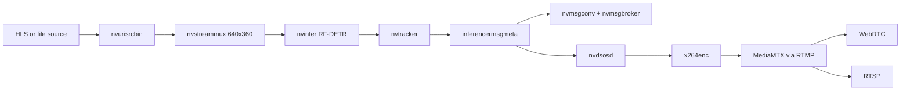

# Architecture

INFERENCER is a DeepStream pipeline for RF-DETR object detection, native NVIDIA
tracking, MQTT telemetry, and RTSP/WebRTC preview on the Jetson Orin Nano
Super.

## Runtime Flow

`run_pipeline.sh` loads `pipeline_config.yml`, prepares the selected model,
generates temporary tracker and MQTT configuration files, and launches the
GStreamer pipeline. The source is decoded at its native resolution; the
streammux dimensions define the normalized processing frame used by inference
and tracking. The output encoder dimensions are configured separately.

## Components

- `run_pipeline.sh`: validates configuration, prepares the model, starts
	MediaMTX when needed, builds the GStreamer graph, and cleans up child
	processes.
- `pipeline_controller.py`: authenticated REST API for model preparation and
	pipeline lifecycle management.
- `inferencer_bbox.cpp`: RF-DETR TensorRT output parser. It converts the
	`dets` and `labels` tensors into DeepStream bounding boxes.
- `inferencer_msgmeta.cpp` and `inferencer_msgconv.cpp`: bridge DeepStream
	metadata into compact MQTT detection payloads.
- `pipeline_config.yml`: source, model, tracking, streammux, timing, output,
	and broker configuration.

## Control API

`GET /status` is unauthenticated. `/load-model`, `/start`, `/stop`, and
`/unload-model` require `Authorization: Bearer $INFERENCER_API_KEY`.

`/load-model` runs model setup and records the selected model. `/start` launches
the runner asynchronously and accepts `output`, optional model and precision
overrides, and an optional per-run `hls_uri`. `/stop` terminates the pipeline,
and `/unload-model` stops it and clears the selected model.

The API's initial `running: true` response means the runner was spawned. Use
`/status` to confirm it remains alive and inspect `last_error` if it exits.

## Outputs

The `file` output writes timestamped MP4 segments. `rtsp` and `webrtc` publish
an RTMP stream to MediaMTX and expose the configured path:

- RTSP: `rtsp://<server>:8554/inferencer`
- WebRTC: `http://<server>:8889/inferencer`

Set `WEBRTC_ADDITIONAL_HOSTS` when the server has an address MediaMTX cannot
discover or when clients connect through a specific LAN address.

## Configuration Boundary

The HLS source advertises its own input dimensions; callers do not need to
provide width and height to `/start`. `streammux.width` and `streammux.height`
are processing dimensions, while `outputs.rtsp.encoder.width` and `.height`
are output dimensions.
